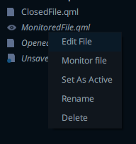

# Projects

As mentioned in the previous section, a project in Livekeys consists of one or more Qml files or components, out of
which one is the main file or the one that's being executed. Livekeys treats these as 2 types of projects: file
based and folder based. The project directory can be accessed whithin qml, by using the
`project.dir()` expression:

```
import QtQuick 2.3

Text{
    text: 'Project path :' + project.dir()
}
```

This helps the access keep files relative to the project folder. For projects that have a single file, the
`project.dir()` expression returns the path to the directory the file is located in.

As a rule within project based files, qml files that start with a capital letter are used as components within
that project folder, since they define new types, and files that start with a lowercase letter are mainly used for
execution like sample files, tests or main.qml files:

```
|- MyComponent.qml
|- samples/myComponentUsage.qml
|- tests/myComponentTest.qml
|- main.qml
```

## Active Files

When opening a project folder, Livekeys expects a similar structure to the above to be present. It will look to set
the active file automatically, by first looking for the main.qml, then looking for a .qml file that starts with a
lowercase letter. After a project is loaded, the user can change the active file manually using the project view. In
terms of behavior, there's a few differences between active files and other files within a Livekeys project. Unless
they are monitored, they support palettes, injection and binding, and the application is updated during code changes
without requiring to save the file.

## Monitored Files

Monitored files within a Livekeys project are files selected by the user that Livekeys monitors in the back for changes.
These files can be modified externally and as soon as they are saved, Livekeys will pick up on their changes and
recompile the project.



Any number of files can be selected for monitoring. While a file is in monitor mode, it cannot be edited inside Live
CV (it will always be opened in read-only mode). To switch a file back to editing mode, use the project view, and
right click on the file that's being monitored and select "Edit":


